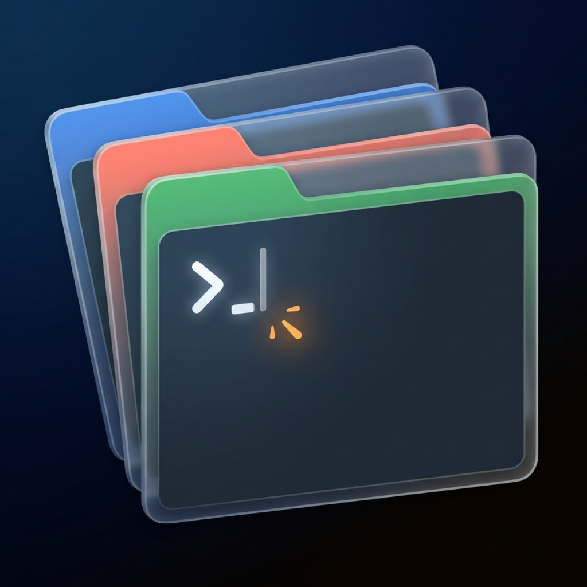
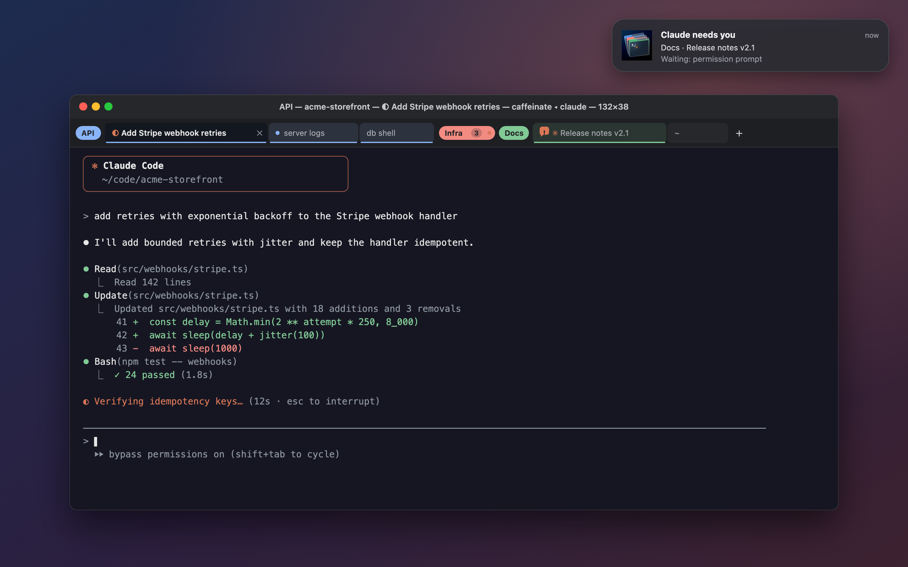

<div align="center">



# Smart Terminal

**Terminal.app, plus Chrome-style tab groups, for people who run a lot of Claude Code.**

[](https://github.com/pluginslab/smart-terminal/releases/latest)
[](https://github.com/pluginslab/smart-terminal/actions/workflows/ci.yml)
[](LICENSE)
[](#install)
[](https://swift.org)

</div>

You have fifteen terminal tabs open across four projects. One is tailing the API
logs, two are SSH'd into servers, and five are running Claude Code. Every tab says
`zsh`. Somewhere a Claude session finished twenty minutes ago and has been waiting
for you ever since.

Smart Terminal keeps the Terminal.app you know (same fonts, colors and title bar) and
adds what that setup needs. Tabs can be **renamed** and gathered into **named,
colored, collapsible groups** that you drag around like Chrome's. Tabs running
Claude Code **name themselves after the session**, show whether Claude is working or
waiting, and **notify you** when one you can't see needs an answer.



## Install

Download the latest **SmartTerminal DMG** from
[Releases](https://github.com/pluginslab/smart-terminal/releases/latest), open it, and
drag Smart Terminal to Applications. It is a signed and notarized universal build
(Apple silicon + Intel) that needs **macOS 26 (Tahoe)** or later.

macOS may ask for two permissions, each the first time it is needed:

- **Notifications**, so you can hear when a Claude session in another tab finishes or needs you.
- **Control Terminal**, only when you use *Import Tabs from Terminal.app*.

Coming from Terminal.app? Use **Shell → Import Tabs from Terminal.app…** to bring your
open tabs over (see [below](#import-from-terminalapp)).

## Usage

### Tabs and groups

| Action | How |
| --- | --- |
| New tab (next to the current one, same group, same folder) | `⌘T` |
| New tab in a group (at its end, in its last tab's folder) | the colored `+` after the group |
| New tab at the end, ungrouped | `+` at the end of the strip, or double-click empty space |
| Rename a tab | double-click it, or `⌘⇧I`. Enter saves, Esc cancels, empty restores the automatic name |
| Put the tab in a new group, or edit its group | `⌥⌘G`, or right-click → *Add Tab to New Group* |
| Collapse or expand a group | click its chip, or `⌥⌘C` |
| Name, color, ungroup, close or move a group | double-click or right-click its chip |
| Move a tab left or right **within its group** | `⌃←` `⌃→` (or `⌃⌥←` `⌃⌥→`, see [Limitations](#limitations)) |
| Switch tabs | `⌘1`…`⌘8`, `⌘9` for the last, `⌃Tab` / `⌃⇧Tab`, `⌘⇧]` / `⌘⇧[` |
| Move a tab or group to a new window | drag it onto the desktop, or right-click → *Move to New Window* |
| New window, close tab, close window | `⌘N`, `⌘W`, `⌘⇧W` |
| Font size, clear, find | `⌘+` `⌘-` `⌘0`, `⌘K`, `⌘F` |

**Dragging.** Where you drop a tab decides its group, the same way Chrome does:

- between two tabs of a group, it joins that group;
- onto a group's chip, it goes to the end of that group;
- onto the left edge of a chip, or next to an ungrouped tab, it is ungrouped;
- drag a chip to move the whole group, including into another window.

Every drop is backed by a model with invariant checks (groups stay contiguous, no
empty groups, no lost tabs). The tests include a randomized run of 8,000 operations
across two windows.

### Claude Code tabs

When a tab runs Claude Code and you haven't renamed it, the tab takes the session's
name: your `/rename`, otherwise Claude's own AI title, otherwise "Claude · folder".
Rename it yourself and your name wins, but Claude's live status prefix stays.

| In the tab | Meaning |
| --- | --- |
| `◐ Add Stripe webhook retries` | Claude is working (the half moon animates, exactly as Claude draws it) |
| `✳ Add Stripe webhook retries` | Claude is idle |
| orange speech bubble with `!` | Claude is waiting on a permission prompt or a question |
| filled orange `✱` | Claude finished while you were in another tab |

When a Claude you can't see finishes or needs you, you get a macOS notification.
Click it to jump to the tab. The Dock badge counts the tabs waiting for you. Hover a
tab for its last prompt and PR link.

**Resume after a restart.** Quit the app, or let it crash, and every tab that was
running Claude comes back with a bar: *Claude session "…" was running here.*
**Resume** (`⌘⇧R`) runs `claude --resume <id>` with the flags the session was started
with. If you exit Claude yourself, the tab forgets the session.

### Sidebar: Claude Code

The sidebar's second pane (the asterisk at its top) shows the Claude Code session in
the current tab, and follows you as you switch tabs:

- **Status:** the asterisk spins while Claude works, with a timer for the current turn.
  It turns orange when Claude needs you, and says why (e.g. a permission prompt).
- **Context:** how full the context is, as a ring and a token count. Claude's replies
  don't record the context window, so it's taken from `/context` or `/model` output if
  you've run one, from a context already past 200k, or from the model the folder last
  used. Failing all of those it shows "~200k". Run `/context` once to make it exact.
- **Subagents** Claude started: running ones with a live timer, finished ones with how
  long they took, their tokens and tool calls.
- **Tokens this session:** output, input, cache reads and cache writes.
- **Prompts** typed, how long the last turn took, when the session started, and the model.

It's all read from Claude Code's own session file and transcript. Each transcript is
read once in full, in the background, and then followed as it grows.

### Sidebar: clipboard history

`⌃⌘S`, or the sidebar button at the right end of the tab strip, opens a panel on the
right. Its first tool is a clipboard history. Every copy lands there and flashes as it
arrives: text (including `pbcopy` from a shell, a script or Claude Code), images
(screenshots, *Copy Image*) and files copied in Finder, shown with a Quick Look preview. If the
sidebar is closed, its button bounces and shows a dot instead.

- **Click** an entry to put it back on the clipboard.
- **Right-click** an entry to paste it into the current tab or delete it. Files paste
  as quoted paths. An image is saved as a PNG in a temporary folder and its path is
  pasted, which Claude Code attaches as an image.
- To paste an image straight into Claude Code, click the entry, then press `⌃V` in Claude.
- Copying something that's already in the list moves it back to the top.

Each entry shows where it came from. That's the tab you were in if the copy happened
in Smart Terminal, otherwise the app you were using.

The history holds the last 50 copies (images up to 200 MB in total), in memory only,
and is gone when you quit. The temporary PNGs are removed at the next launch.
Copies that password managers mark as concealed or transient (the
[nspasteboard.org](http://nspasteboard.org) markers, which 1Password uses) are never recorded.

### The title bar

The title bar follows Terminal.app's format and updates live, spinner included:

```
API — acme-storefront — ◐ Add Stripe webhook retries — caffeinate ◂ claude — 132×38
group  folder            what the program set as title   newest process ◂ command   size
```

### Import from Terminal.app

**Shell → Import Tabs from Terminal.app…** lists your open Terminal.app tabs, grouped
by project folder, with a checkbox each:

- **Claude sessions are handed over.** Smart Terminal types `/exit` into the session
  in Terminal.app, waits for it to stop, and resumes it here with the same flags. A
  session is never running in two places at once.
- **tmux sessions are re-attached here**, and Terminal.app's client is detached.
  Nothing inside tmux restarts.
- **Plain shells** reopen in the same folder.

Claude sessions that are **working right now start unchecked**, because handing one
over stops it mid-turn.

### Look and feel

Smart Terminal reads your **Terminal.app default profile**: font, colors, the 16-color
ANSI palette, background opacity and blur, and "Use Option as Meta key". If that
profile can't be read, it falls back to a built-in dark or light theme.

Your windows, groups (name, color, collapsed state), tab order, custom names and each
tab's working folder are saved and restored at launch. Shells restart in the folder
they were in.

## How it works

Claude Code writes two things Smart Terminal reads, and it never asks Claude for
anything:

- **`~/.claude/sessions/<pid>.json`**, one small file per running Claude process, with
  the session id, folder and a status of `busy`, `idle` or `waiting` (plus
  `waitingFor`, such as a permission prompt). The process group in the foreground of a
  tab's terminal *is* that pid, so detection is exact. The file is read about once a
  second, and only while a program other than the shell is in front.
- **The session transcript** (`~/.claude/projects/…/<session-id>.jsonl`), for the
  `custom-title`, `ai-title`, `last-prompt` and `pr-link` entries. Transcripts reach
  tens of megabytes, so they are never read whole. The app scans backwards from the end
  in growing windows until it finds a title, then reads only newly appended bytes.

The working/idle animation comes straight from the title Claude sets (`◐`/`◑` while
busy, `✳` when idle). The working folder, command line and newest child process come
from the kernel (`libproc`, `sysctl`), so no shell integration or rc-file changes are
needed.

Import uses AppleScript to list Terminal.app's windows and tabs and their ttys, `ps`
to find each tab's shell and foreground job, the Claude session file to recognise
Claude, and `tmux list-clients` to map a tty to a tmux session.

### Privacy

Everything stays on your Mac. **Smart Terminal makes no network requests.**
Notifications are local, and links open only when you click them. The clipboard
history is kept in memory. An image is written to a temporary file only when you paste
it into a tab. What it reads,
writes and runs is listed in [SECURITY.md](SECURITY.md).

## Configuration

| Variable | Meaning |
| --- | --- |
| `CLAUDE_CONFIG_DIR` | Where Claude Code keeps its data. Defaults to `~/.claude`. |
| `SMART_TERMINAL_SUPPORT_DIR` | Where the layout is saved. Defaults to `~/Library/Application Support/SmartTerminal`. |

## Development

```bash
swift test                   # core model tests (tabs, groups, drops, Claude parsing, import planning)
scripts/bundle.sh --open     # debug build of SmartTerminal.app, then launch it
scripts/dev-run.sh           # dev instance with its own layout file and a debug control channel
scripts/test-run.sh          # throwaway test instance for automated checks
python3 scripts/mock-screenshot.py   # regenerate assets/screenshot.{svg,png} from demo data
scripts/release.sh           # universal build, Developer ID signing, notarization, DMG in dist/
```

Swift 6.2 and Xcode 26. `SmartTerminalCore` is the UI-free model (tabs, groups, drop
targets, persistence, Claude parsing) and holds almost all of the logic, all of it
unit-tested. `SmartTerminal` is the AppKit/SwiftUI app. Terminal emulation is by
[SwiftTerm](https://github.com/migueldeicaza/SwiftTerm).

See [CONTRIBUTING.md](CONTRIBUTING.md). The design notes and the build log are in
[`docs/`](docs).

## Limitations

- **Claude inside tmux is not detected yet.** The tab's foreground process is the
  tmux client, so Claude's status and title don't reach it.
- **`⌃←` `⌃→` are taken by macOS** for switching Spaces by default. Turn off *Move
  left/right a space* in System Settings → Keyboard → Keyboard Shortcuts → Mission
  Control, or use `⌃⌥←` `⌃⌥→`.
- **No automatic updates yet.** Watch the repository's releases.
- **No split panes**, and processes don't survive quitting the app. Only the layout
  and Claude sessions (via resume) come back.
- **Clipboard sources are a best guess.** macOS doesn't say who wrote to the
  clipboard, so a `pbcopy` in a background tab shows up under the tab or app that
  was in front at the time.
- **macOS 26 or later only.**

## License

[MIT](LICENSE). Terminal emulation by [SwiftTerm](https://github.com/migueldeicaza/SwiftTerm) (MIT).
